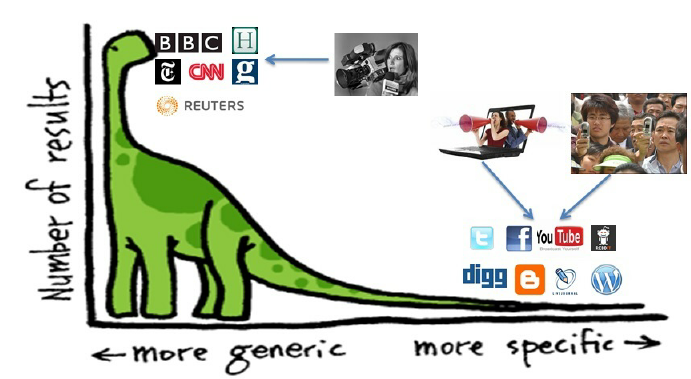

# Performance of Recommender Algorithms on Top-N Recommendation Tasks: Crítica y análisis

Autor: Vicente Aguilera Yévenes

Este paper presenta un análisis general sobre la diferencia existente entre algoritmos de recomendación cuando se busca completar una tarea de recomendación tipo **Top-N**, que consiste en *encontrar* y *ordenar* un grupo de items más propensos a ser del gusto del usuario que se analiza. También se refiere a la diferencia que existe entre utilizar algoritmos que están diseñados para rendir sobre métricas basadas en el error (como RMSE o MAE), y algortimos que están diseñados para rendir en métricas basadas en la exactitud (*accuracy*), como lo son *Precision* y *Recall*. Además, explican como generar un set de entrenamiento y testeo que minimice el riesgo de introducir *bias* en el modelo, principalmente con el fenómeno de *Short-Head/Long-Tail*, donde los datos están dispuestos de tal manera que muy pocos items contiene muchas interacciones (*Short-Head*), y muchos items contienen pocas interacciones (*Long-Tail*)

En cuanto a las metodologías de testeo, creo que es un muy buen aporte el que hacen los autores con respecto a generar un test set $T$ que contenga solo los items con rating de 5 estrellas, esto permite trabajar con un set que representa fielmente las preferencias del usuario.

Creo que el *paso a paso* indicado por los autores para entrenar el modelo y generar la variable $p$ para trabajar sobre *Precision* y *Recall* es muy buena, y también creo que el hecho de tomar como hipótesis que los -en el caso de los autores- 100 itemes seleccionados de manera aleatoria son indiferentes al usuario, para de esta manera subestimar el valor de *Precision* y *Recall* es una excelente idea, y va de la mano con lo planteado por Shani y Gunawardana, ya que los testeos se deben hacer en aquellas situaciones que no representen necesariamente un *happy path*, al menos en este caso donde se presenta un *offline setting*.

También creo que es muy buena medida el generar un $T_{head}$ y un $T_{long}$, para analizar el desempeño en exactitud, y al mismo tiempo tener a mano la información necesaria para estudiar el desempeño en elementos secundarios, como lo son *serendipity* y *novelty*.

Con respecto a los modelos utilizados, los autores señalan que la versión implementada de **NNCosNgbr** tenia un mejor desempeño con *cosine similarity*, lo que me parece extraño ya que la literatura señala que *adjusted cosine* tiende a ser mejor ya que excluye *biases* por usuario pesimistas/optimista e items hiper/sub rankeados.

En cuanto a los resultados, creo que son bastantes consistentes, dado que -tal como señalan los autores- los modelos diseñados para tener un mejor rendimiento en métricas de exactitud son aquellos que tienen mejor desempeño, ya que su principal tarea no es predecir un rating numérico, si no que generar un lista ordenada de items de tal manera que los que realmente deben estar ahí, lo estén. El comportamiento de **TopPop** es bastante correcto con lo que teóricamente debiese ocurrir: Si se emplea sobre el dataset *Short-Head* que contiene los items más populares, su rendimiento será bueno, si se emplea en el segmento *Long-Tail*, claramente no cuenta con las capacidades de recomendar lo más popular. En cuanto al comportamiento de **PureSVD**, me llama la atención que sobre el segmento *Short Head* tenga mejor rendimiento con menos factores latentes que sobre el segmento *Long Tail*, pero esto es un tanto lógico, ya que se deben encontrar más patrones o *features* sobre items con pocas interacciones, ya que no se sabe a ciencia cierta que es lo que llama la atención a los usuarios.

Los autores hacen un alcance muy importante: Los modelos orientados en el error se entrenan solo con los ratings conocidos, dejando de lados aquellos que no se tienen, lo que es bastante alejado a la realidad. En cambio los modelos basados en exactitud toman en consideración todos los posibles escenarios de interacción, tomando en consideración incluso aquellos items sin rating.

Creo que lo planteado por los autores es un tremendo aporte y permite ver dos cosas importantes:

1. La selección del modelo debe ir de la mano con los objetivos de la implementación del sistema, porque no hay modelo que sea la *Panacea* de la recomendación, dado que los comportamientos difieren según el contexto
2. Es importante tomar en consideración los comportamientos más "reales" de un sistema al momento de seleccionar un modelo, en especial para comenzar una tarea de recomendación (se tienen pocos datos, el sistema recibe nuevos inputs de manera frecuente, etc.). Es por esto que los autores recomiendan *PureSVD* como un punto de partida.